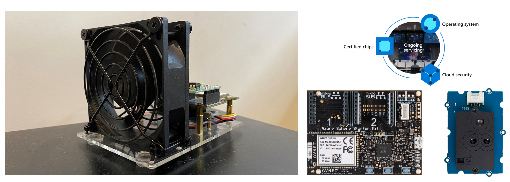

# Predictive maintenance with Machine Learning and Azure Sphere

Documentation is being updated - will be completed by Dec 12, 2022

[Documentation](https://gloveboxes.github.io/AiPoweredPredictiveMaintenanceDocs)

## Watch the 10 minute end-to-end demo

## Machine Learning Predictive Maintenance Unit

### Parts list

1. [Avnet Azure Sphere Starter Kit](https://www.avnet.com/wps/portal/us/products/avnet-boards/avnet-board-families/ms-azure-sphere/)
1. [MikroE Relay Click](https://www.mikroe.com/relay-click)
1. Fans (Amazon). upHere PC Fan, 80mm Silent USB Fan Compatible for Computer / PS4 / TV Box/AV Cabinet,U803
